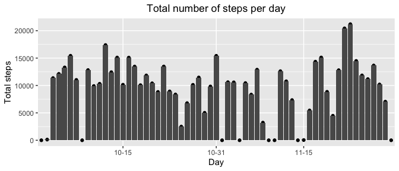
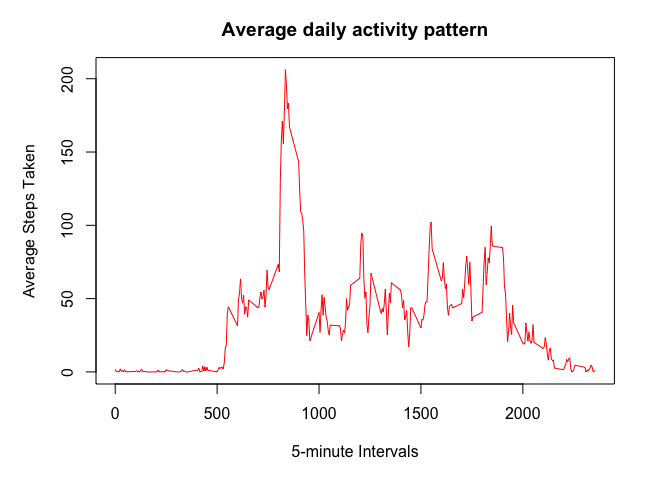
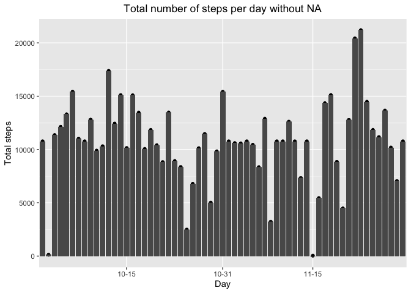
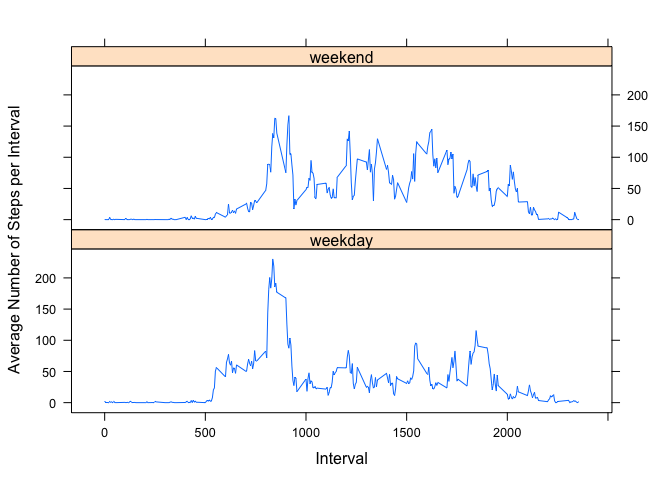

## Loading and preprocessing the data

```r
url<-"https://d396qusza40orc.cloudfront.net/repdata%2Fdata%2Factivity.zip"
download.file(url, destfile ="./activity.zip",method="curl")
unzip(zipfile = "./activity.zip", exdir = "./")
data<-read.csv("activity.csv",sep=",")
data$date <- as.Date(data$date, format = "%Y-%m-%d")
data$monthday<-(format(data$date, "%m-%d"))
str(data)
```

```
## 'data.frame':	17568 obs. of  4 variables:
##  $ steps   : int  NA NA NA NA NA NA NA NA NA NA ...
##  $ date    : Date, format: "2012-10-01" "2012-10-01" ...
##  $ interval: int  0 5 10 15 20 25 30 35 40 45 ...
##  $ monthday: chr  "10-01" "10-01" "10-01" "10-01" ...
```


## What is mean total number of steps taken per day?

```r
library(ggplot2)
total<-with(data,tapply(steps, monthday, sum,na.rm=TRUE))
par(mar=c(5,5,3,3))
qplot(unique(data$monthday),as.vector(total), show.legend = FALSE)+geom_bar(stat = "identity", show.legend = FALSE)+scale_x_discrete(breaks=c("10-15","10-31","11-15")) +
  xlab("Day") + ylab("Total steps") +
  ggtitle("Total number of steps per day") + 
  theme(plot.title = element_text(hjust = 0.5))
```

<!-- -->

```r
  total<-with(data,tapply(steps, monthday, sum))
  meansteps<-mean(total,na.rm=TRUE)
  mediansteps<-median(total,na.rm=TRUE)
```
The mean is 1.0766189\times 10^{4} and the median is 10765.

## What is the average daily activity pattern?

```r
averageperinterval<-aggregate(steps ~ interval, data = data, FUN = mean, na.rm = TRUE)
par(mar=c(5,5,3,3))
plot(unique(data$interval),averageperinterval[,2],type="l",col="red",
       main = "Average daily activity pattern",  
       xlab = "5-minute Intervals",  
       ylab = "Average Steps Taken")
```

<!-- -->

```r
maximum<-averageperinterval[which.max(averageperinterval$steps),1]
```
The maximum of 5-minute interval is 835.


## Imputing missing values

```r
nofNA<-colSums(is.na(data))
print(nofNA)
```

```
##    steps     date interval monthday 
##     2304        0        0        0
```

```r
newdata <- data
nas<-is.na(newdata$steps)
meanperinterval<-with(newdata,tapply(steps, interval, mean,na.rm=TRUE))

newdata$steps[nas]<-meanperinterval[as.character(newdata$interval[nas])]

total<-with(newdata,tapply(steps, monthday, sum,na.rm=TRUE))
par(mar=c(5,5,3,3))
qplot(unique(newdata$monthday),as.vector(total), show.legend = FALSE)+geom_bar(stat = "identity", show.legend = FALSE)+scale_x_discrete(breaks=c("10-15","10-31","11-15")) +
  xlab("Day") + ylab("Total steps") +
  ggtitle("Total number of steps per day without NA") + 
  theme(plot.title = element_text(hjust = 0.5))
```

<!-- -->

```r
  newmeansteps<-mean(total,na.rm=TRUE)
  newmediansteps<-median(total,na.rm=TRUE)
```
The number of NA in steps is  2304.

The new mean is 1.0766189\times 10^{4} and the new median is 1.0766189\times 10^{4}. As we can see the mean is the same to the one of the data set with NA while the medians are a bit different. Of course the quantiles are different.

## Are there differences in activity patterns between weekdays and weekends?

```r
library(lattice)
Sys.setlocale(locale = 'en_US.UTF-8')
```

```
## [1] "en_US.UTF-8/en_US.UTF-8/en_US.UTF-8/C/en_US.UTF-8/es_ES.UTF-8"
```

```r
newdata$day <- ifelse(weekdays(newdata$date) == "Saturday" | weekdays(newdata$date) == "Sunday", "weekend", "weekday")
averageperintervalandday<-aggregate(steps ~ interval+day, data = newdata, FUN = mean, na.rm = TRUE)
xyplot(steps~interval|day, data=averageperintervalandday, type="l",  layout = c(1,2),  ylab="Average Number of Steps per Interval", xlab="Interval")
```

<!-- -->

